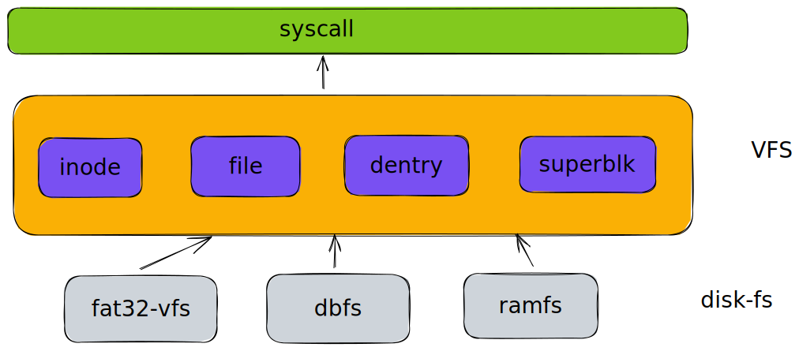

# VFS
The VFS framework is a virtual file system framework for Rust. It provides a unified interface for accessing different file systems. It is designed to be extensible and easy to use.

## Description



## The interface

```rust
pub fn vfs_open_file<T: ProcessFs>(
    name: &str,
    flags: OpenFlags,
    mode: FileMode,
) -> StrResult<Arc<File>>
pub fn vfs_getattr<T: ProcessFs>(file_name: &str,flag:StatFlags) -> StrResult<FileAttribute> 
pub fn vfs_getattr_by_file(file: Arc<File>) -> StrResult<FileAttribute> 
pub fn vfs_statfs<T: ProcessFs>(file_name: &str) -> StrResult<StatFs> 
pub fn vfs_statfs_by_file(file: Arc<File>) -> StrResult<StatFs>
pub fn vfs_setxattr<T: ProcessFs>(file_name: &str, key: &str, value: &[u8]) -> StrResult<()> 
pub fn vfs_setxattr_by_file(file: Arc<File>, key: &str, value: &[u8]) -> StrResult<()> 
pub fn vfs_getxattr<T: ProcessFs>(
    file_name: &str,
    key: &str,
    value: &mut [u8],
) -> StrResult<usize>
pub fn vfs_getxattr_by_file(
    file:Arc<File>,
    key: &str,
    value: &mut [u8],
) -> StrResult<usize> 
pub fn vfs_removexattr<T: ProcessFs>(file_name: &str, key: &str) -> StrResult<()> 
pub fn vfs_removexattr_by_file(file: Arc<File>, key: &str) -> StrResult<()> 
pub fn vfs_listxattr<T: ProcessFs>(file_name: &str, buf: &mut [u8]) -> StrResult<usize>
pub fn vfs_listxattr_by_file(file:Arc<File>,buf:&mut [u8])->StrResult<usize>
pub fn vfs_close_file<T: ProcessFs>(file: Arc<File>) -> StrResult<()>
pub fn vfs_read_file<T: ProcessFs>(
    file: Arc<File>,
    buf: &mut [u8],
    offset: u64,
) -> StrResult<usize>
pub fn vfs_write_file<T: ProcessFs>(file: Arc<File>, buf: &[u8], offset: u64) -> StrResult<usize> 
pub fn vfs_mkdir<T: ProcessFs>(name: &str, mode: FileMode) -> StrResult<()> 
pub fn vfs_llseek(file: Arc<File>, whence: SeekFrom) -> StrResult<u64>
pub fn vfs_readdir(file: Arc<File>) -> StrResult<DirContext>
pub fn vfs_fsync(file: Arc<File>) -> StrResult<()> 
pub fn vfs_rmdir<T: ProcessFs>(dir_name: &str) -> StrResult<()> 
pub fn vfs_truncate<T: ProcessFs>(file_name: &str, len: usize) -> StrResult<()> 
pub fn vfs_rename<T: ProcessFs>(old_name: &str, new_name: &str) -> StrResult<()>
pub fn vfs_link<T: ProcessFs>(old: &str, new: &str) -> StrResult<()>
pub fn vfs_symlink<T: ProcessFs>(target: &str, link: &str) -> StrResult<()>
pub fn vfs_readlink<T: ProcessFs>(path: &str, buf: &mut [u8]) -> StrResult<usize>
pub fn vfs_unlink<T: ProcessFs>(name: &str) -> StrResult<()>
pub fn do_mount<T: ProcessFs>(
    dev_name: &str,
    dir_name: &str,
    fs_type: &str,
    flags: MountFlags,
    data: Option<Box<dyn DataOps>>,
) -> StrResult<Arc<VfsMount>> 
pub fn do_unmount(mount: Arc<VfsMount>, _flags: MountFlags) -> StrResult<()> 
pub fn do_kernel_mount(
    fs_type: &str,
    flags: MountFlags,
    dev_name: &str,
    mnt_flags: MountFlags,
    data: Option<Box<dyn DataOps>>,
) -> Result<Arc<VfsMount>, &'static str> 
pub fn vfs_lookup_path(dentry:Arc<DirEntry>,mnt:Arc<VfsMount>,path:ParsePathType,_flag:LookUpFlags) -> StrResult<String>
pub fn register_filesystem(fs: FileSystemType) -> Result<(), &'static str>
pub fn unregister_filesystem(fs_type: FileSystemType) -> Result<(), &'static str>

pub fn lookup_filesystem(name: &str) -> Option<Arc<FileSystemType>>
```


## Usage
`rvfs` provides a simple memory file system. When initializing vfs, you need to initialize `ramfs` as the original mount point. 
Of course, if there is no other file system, you can also directly perform file operations on `ramfs`.
`ramfs` provides most of the interfaces of vfs.

```rust
fn main() {
    println!("init vfs");
    let rootfs = mount_rootfs();
    init_process_info(rootfs);
    let file1 = vfs_open_file::<FakeFSC>(
        "/file1",
        FileFlags::O_CREAT | FileFlags::O_RDWR,
        FileMode::FMODE_WRITE | FileMode::FMODE_READ,
    ).unwrap();
    vfs_write_file::<FakeFSC>(file1.clone(), b"hello", 0).unwrap();
    vfs_rename::<FakeFSC>("/file1", "/file3").unwrap();
    let root = vfs_open_file::<FakeFSC>("/", FileFlags::O_RDONLY, 			    							     	    		FileMode::FMODE_READ).unwrap();
    // println!("root: {:#?}", root);
    vfs_readdir(root.clone())
    .unwrap()
    .into_iter()
    .for_each(|name| {
        println!("name: {}", name);
    });
    let mut buf = [0u8; 5];
    vfs_read_file::<FakeFSC>(file2, &mut buf, 0).unwrap();
}

```

